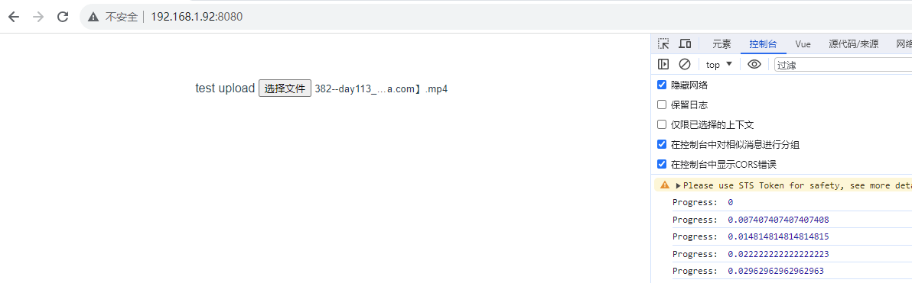
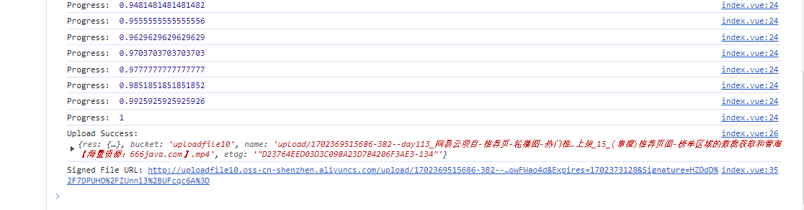
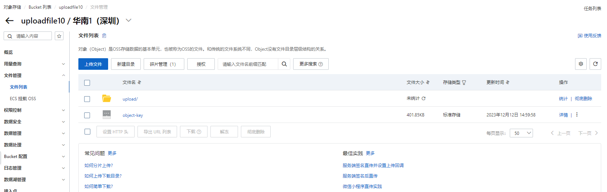
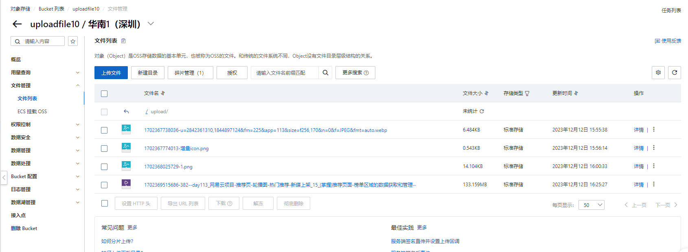

```vue
<template>
  <input type="file" @change="handleFileChange" />
</template>

<script>
import OSS from 'ali-oss';

export default {
  name: 'test-upload',
  methods: {
    async uploadFile(file) {
      const client = new OSS({
        region: 'oss-cn-shenzhen',
        accessKeyId: 'LTAI5t7VWVxSAMjoowFWao4d', //在前端代码中暴露密钥不安全
        accessKeySecret: 'mzawznYW6c0raKH17IY6iGVzJQdg7t', // 同上
        bucket: 'uploadfile10'
      });

      // 生成唯一文件名
      const objectKey = `upload/${Date.now()}-${file.name}`;

      try {
        const result = await client.multipartUpload(objectKey, file, {
          progress: (p) => console.log('Progress: ', p),
        });
        console.log('Upload Success:', result);

        // 获取上传后的文件URL
        // const fileUrl = client.generateObjectUrl(objectKey);
        // console.log('File URL:', fileUrl);

     //私有Bucket：如果您的OSS Bucket设置为私有（默认设置），那么直接通过URL是无法访问文件的。您需要生成一个带签名的URL，才能访问这些私有文件。
     // 解决方法：在生成URL时使用带有有效期的签名。例如：
        const fileUrl = client.signatureUrl(objectKey, { expires: 3600 });
        console.log('Signed File URL:', fileUrl);
        // this.$emit('uploadSuccess', fileUrl);
        // 或者其他方法，如调用API发送到后端

      } catch (e) {
        console.error('Upload Error:', e);
      }
    },
    handleFileChange(e) {
      const file = e.target.files[0];
      if (!file) return;
      this.uploadFile(file);
    }
  }
};
</script>

```
## 页面展示（Progress是上传进度）


## 获取上传后的url


## 阿里云文件列表中查看上传文件


